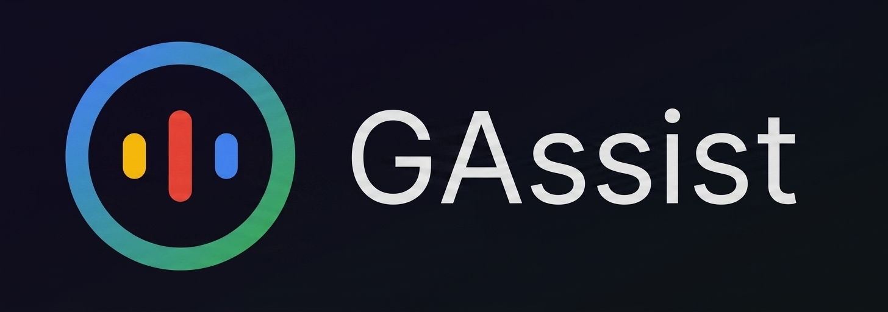

# GAssist Launcher



<p align="center">
  A lightweight Android utility for quick access to Google Assistant through a simple shortcut-based workflow.
</p>

---

## Overview

GAssist Launcher is designed for users who want a fast, software-defined way to launch Google Assistant without relying on hardware buttons.

## Installation

1. Clone the repository.

2. Open the project in Android Studio.

3. Make sure the required Android SDK and JDK are installed.

4. Build the release APK:

   ```bash
   ./gradlew assembleRelease
   ```

5. Install the APK on an Android device with Google Play Services enabled.

## Usage

### Quick launch

1. Install the app on a device that already has Google app / Google Assistant support.
2. Add the app shortcut to your launcher or pin it to the home screen from a supported launcher.
3. On supported devices, map the app to a hardware shortcut such as the side key or power button from system settings.

### Supported shortcut examples

* **Samsung Galaxy**: `Settings → Advanced features → Side key` → set **Double press** to launch an app.
* **Pixel devices**: `Settings → Apps → Default apps → Digital assistant app`.
* **Other Android phones**: look for options named **Buttons**, **Gestures**, **Shortcuts**, **Convenience tools**, or **Special features**.

### Shortcut notes

* Android supports app shortcuts and pinned shortcuts in supported launchers.
* Some launchers may limit how many shortcuts are visible.
* Not every Android device supports remapping the side button to an app.

## Technical Overview

GAssist Launcher works as a simple intent relay. It tries to open Google Assistant using native Android voice-command intents and fallback component mappings when needed.

## Architecture

* **Language:** Kotlin
* **Min SDK:** 24 (Android 7.0)
* **Target SDK:** 35 (Android 15)
* **Pattern:** Single-Activity Intent Relay

## Features

* Direct intent mapping for fast assistant access
* Component fallback system for broader compatibility
* Auto-termination after dispatching the intent
* Store redirection when required Google services are unavailable

## Permissions and Security

* No internet permission
* No microphone permission
* No storage permission
* Uses package visibility declarations only for Google app detection on Android 11+

## Development

### Prerequisites

* Android Studio Ladybug or newer
* JDK 21
* Android SDK Platform 35

### Build

```bash
./gradlew assembleRelease
```

## Maintenance and Contribution

This project is intentionally minimal and low-overhead. Contributions that improve compatibility across regions, devices, or Android forks are welcome.

1. Fork the repository.
2. Create a feature branch.
3. Submit a pull request with a clear changelog.

## License

This project is licensed under the **GNU General Public License v3.0 (GPLv3)**.

### What this means

* You are free to use, modify, and distribute this software.
* Any modified or redistributed version must also be released under GPLv3.
* You must provide access to the source code when distributing the software.

### Key points

* **Copyleft:** Prevents the project from being turned into closed-source software.
* **Patent protection:** Provides safeguards against patent-related restrictions.
* **User freedom:** Ensures
